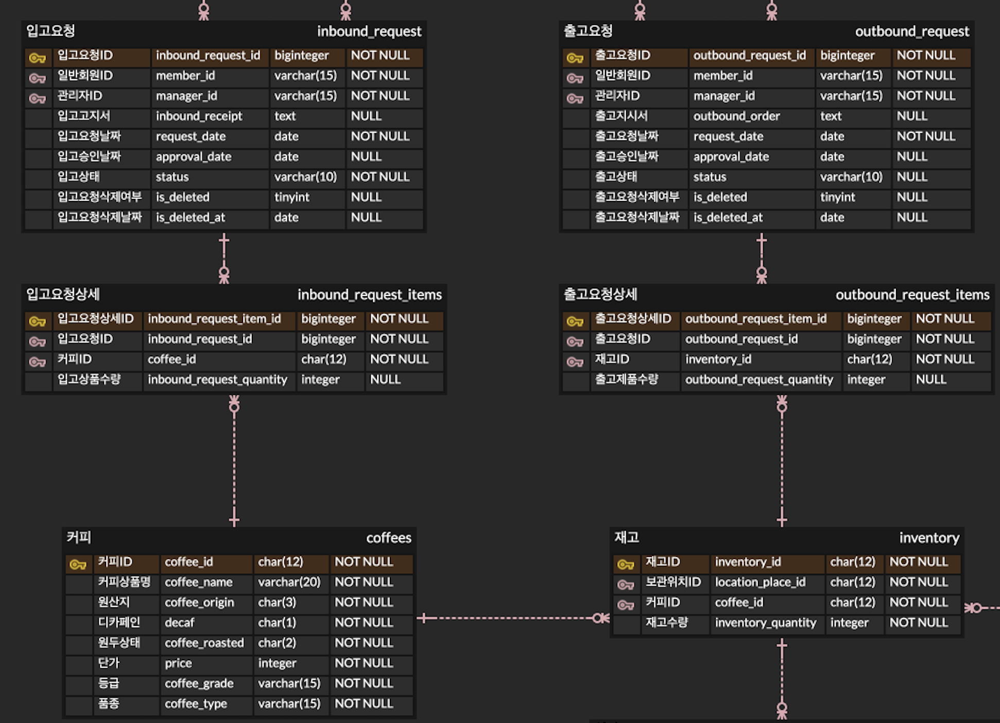

# D.J로스터리(Dulce Joya roastery)

---

[신세계아이앤씨] JAVA 기반 백엔드 개발자 양성 9 차수에서 진행하는 CLI 기반 첫번째 미니 프로젝트입니다. WMS창고관리시스템을 JAVA와 MySQL 기반 데이터베이스를 활용하여 구현하였습니다.

## 프로젝트 소개

---

고객들에게 단순히 원두만을 공급 해주는 것이 아닌 그들에게 트랜드와 경쟁력을 공급해주는 ‘D.J로스터리’ 달콤한 보석을 창설하고 국내 대형 커피업체들에게 로스팅과 함께 커피 전문 창고관리시스템을 개발합니다.

## 개발 기간

---

- 2025.09.22(월) ~ 2025.09.29(월) (7일)
- 프로젝트 시나리오
- WMS\_타당성 조사
- 프로덕트 테이블 정의
- 기능명세서 및 유스케이스 명세서 작성
- ERD 구현
- 유닛테스트
- 통합테스트

## 개발담당 파트

---

- **박기웅(팀장)**: 입고, 출고관리
- **고하원(화면설계)**: 고객센터
- **김재윤(ERD)**: 재고관리
- **이현빈(API 명세)**: 로그인, 회원관리
- **신건(기획)**: 창고관리

### 프로젝트 수행도구

---

- **IntelliJ 3.6**
- **MySQL 8.0**
- **ERD cloud** : https://www.erdcloud.com/d/Act5DawFyDmdC5h6z
- **Git & Github** :https://github.com/Santiago-kwp/CoffeeWMS_1stPJ_SSG9th
- **Notion 주소** : https://www.notion.so/25-9-19-v0-1-273665119e0b81019542c5d64ace5ba5

## 패키지 구조

```java
📦DJRoastery
├── 📂config
│   ├── 📜DBUtil.java
│   └── 📜dbinfo.properties
├── 📂constant
│   ├── 📜TransactionText.java
│   ├── 📜ErrorCode.java
├── 📂controller
│   └── 📂command
│	│   ├── 📜Command.java (interface)
│	│   ├── 📜AbstractInboundCommand.java (abstract class)
│	│	├── 📂inbound
│	│	│	├── 📜RequestInboundCommand.java
│	│	│	├── 📜ApproveInboundCommand.java
│	│	│	└── 📜...otherCommands.java
│	│	└── 📂outbound
│   └── 📜InboundController.java
│   └── 📜OutboundController.java
├── 📂domain
│   ├── 📂vo
│   │   ├── 📜InboundRequestVO.java
│   │   ├── 📜InboundRequestItemVO.java
│   │   └── 📜InboundStatus.java (Enum)
│   ├── 📂dto
│   │   ├── 📜InboundRequestDTO.java
│   │   └── 📜InboundRequestItemDTO.java
├── 📂exception
│   ├── 📜TransactionException.java
│   └── 📜ValidationException.java
├── 📂model
│   ├── 📜InboundRequestDAO.java (interface)
│   ├── 📜InboundRequestItemDAO.java (interface)
│   ├── 📜InboundRequestDAOImpl.java
│   └── 📜InboundRequestItemDAOImpl.java
├── 📂service
│   ├── 📜InboundService.java (interface)
│   └── 📜InboundServiceImpl.java
└── 📂view
    ├── 📜InboundView.java
    ├── 📜OutboundView.java
    ├── 📜ValidCheck.java
    └── 📜InputHandler.java


```

---

패키지 역할 설명

- **`config`**: 데이터베이스 접속 정보와 설정 클래스를 포함합니다. 애플리케이션의 환경 설정을 관리합니다.
- **`constant`**: 애플리케이션 전반에서 사용되는 **상수**를 정의합니다. 여기에는 뷰에 표시되는 텍스트, 에러 코드, 유효성 검사 규칙 등이 포함됩니다.
- **`controller`**: **모델(Model)과 뷰(View)** 사이의 중개자 역할을 합니다. 커맨드(`command`) 패턴을 활용하여 요청을 보내는 객체 (`controller`)와 요청을 처리하는 객체(`service`)를 완전히 분리합니다. ⇒ 컨트롤러는 어떤 커맨드가 실행되는지만 알면 되고, 커맨드 객체 내부에서 실제 비지니스 로직(서비스 호출)과 사용자 인터페이스(뷰 호출)가 처리됩니다.
- **`domain`**: 비즈니스 로직의 핵심이 되는 **데이터 모델(VO, Value Object)**을 정의합니다. VO는 DB 테이블의 엔티티를 복제하며, 불변 객체로(`immutable object`) 오직 조회만 가능합니다.(`getter` only). 반면, DTO는 주로 계층 간(예: 컨트롤러 계층과 서비스 계층, 또는 서비스 계층과 DAO 계층) 데이터 전송을 위해 정의하며, setter 메소드가 있고, ResultSet을 인자로 받는 생성자를 추가합니다.
- **`exception`**: 프로젝트에서 발생하는 **사용자 정의 예외**를 정의합니다. 입출고 비지니스 로직에서 발생하는 예외와 유효성 검사에서 발생하는 예외로 구분합니다.
- **`model`**: **데이터베이스 접근 로직**을 담당하는 DAO(Data Access Object) 클래스를 포함합니다.
- **`service`**: **비즈니스 로직**을 구현하는 서비스 클래스를 담고 있습니다. `InboundService`는 입고와 관련된 핵심 기능을 처리하며, 여러 DAO를 조합하여 복잡한 작업을 수행할 수 있습니다. (예: 입고 세부 요청 아이템 수정 시 삭제 후 추가, 입고 요청 승인 시 재고 추가 및 입고 요청 승인 속성 업데이트 등)
- **`view`**: 사용자에게 정보를 표시하고 입력을 받는 **CLI 뷰**를 담당합니다. `InboundView`는 사용자에게 메뉴를 보여주고, 결과를 출력하며, 사용자 입력을 받습니다. 이때, 사용자 입력의 유효성을 검증하기 위한 ValidCheck 클래스와 입력을 처리할 핸들러 클래스를 정의합니다.

## ERD



- 입/출고 요청 테이블
  - 입/출고 요청은 일반 회원이 할 수 있으며, 하나의 입/출고 요청에 대해서 한 명의 일반 회원과 해당 요청을 승인하는 하나의 관리자가 존재할 수 있습니다.
  - 한 건의 입/출고 요청에 대해 하나의 입/출고 요청 날짜를 가지며, 관리자의 승인 날짜, 입고 상태(대기, 승인완료, 승인거절, 입고완료)가 존재합니다.
  - 회원이나 관리자가 하나의 입고 요청을 삭제할 수는 있지만, 이때 물리적 삭제가 아닌 논리적 삭제로 해당 입/출고 요청의 입고요청 삭제여부와 입고요청 삭제날짜가 저장됩니다.
- 입/출고 요청 상세 테이블
  - 회원의 입/출고 요청 시 하나의 입/출고 요청에는 한 개 이상의 커피ID, 수량이 장바구니로 존재할 수 있습니다.
  - 입고 요청 시 회원은 커피 테이블과 연결되어 입고 요청할 수 있는 커피 상품의 상세 내용을 조회하여 입고 요청할 수 있습니다.
  - 출고 요청 시 회원은 재고 테이블과 연결되어, 회원 자신과 연동된 보관위치에 있는 커피ID, 재고 수량에 따라 출고 요청을 할 수 있습니다.

## 주요기능

---

### 고객센터

- **공지사항**: 총관리자가 생성한 공지사항을 회원, 창고관리자가 조회, 상세조회 할 수 있도록 만든 기능
- **1:1 문의**: 회원이 문의한 문의사항을 총관리자가 확인 후 답변할 수 있도록 만든 기능
- **FAQ**: 총관리자가 많은 회원들이 문의한 내용들을 정리하여 1:1 문의로 대기할 필요없이 문의사항을 해결할 수 있도록 만든 기능

### 창고관리

- **창고 등록**: 새로운 창고를 등록(총관리자 전용)
- **창고 수정**: 창고의 속성을 변경(총관리자 전용)
- **창고 삭제**: 등록된 창고 삭제(총관리자 전용)
- **전체 조회**: 등록된 창고 전체 조회(관리자전체기능) 각각 조회에는 사용률 계산 포함
- **이름별 조회**: 창고 이름별 조회(관리자전체기능)
- **소재지별 조회**: 창고 소재지별 조회(관리자전체기능)
- **등급조회**: 창고 등급지별 조회(관리자전체기능)

### 입출고 (본인 담당)

- **입고관리**
  - **회원 입고 요청**: 회원이 입고를 원하는 커피의 ID와 수량을 여러 건 묶어서(입고요청 1건 : 입고 상품 및 수량 N건) 입고 요청 날짜와 함께 입고를 요청하는 기능
  - **회원 입고 요청 수정/삭제**: 회원의 아직 미승인된 입고 요청을 수정 혹은 삭제하는 기능
  - **회원 입고 현황 조회**: 회원의 미승인/승인된 입고 현황을 조회
  - **관리자 입고 요청 승인**: 관리자가 여러 회원들의 입고 요청을 승인하는 기능
  - **관리자 입고 요청 수정/삭제**: 관리자가 여러 회원들의 입고 요청을 수정 혹은 삭제하는 기능
  - **관리자 입고 요청 위치 지정**: 관리자가 회원의 입고 요청 상품 및 수량을 확인하고, 적치 가능한 위치를 지정하는 기능
  - **승인된 입고 내역 재고 반영**: 관리자가 입고 요청 승인 및 위치 지정에 따라 재고에 커피ID, 수량, 위치를 업데이트 하는 기능
- **출고관리**
  - **회원 출고 요청**: 회원이 본인의 출고 가능한 입고 현황(커피ID 및 현재 수량)을 확인하고, 커피 ID 및 요청 수량을 여러 건 묶어서 출고 요청 날짜와 함께 출고를 요청하는 기능
  - **회원 출고 현황 조회**: 회원의 미승인/승인된 출고 현황을 조회
  - **관리자 출고 요청 승인**: 관리자가 여러 회원들의 출고 요청을 승인하는 기능
  - **승인된 출고 내역 재고 반영**: 관리자가 출고 요청 승인에 따라 재고에 커피ID, 수량을 업데이트 하는 기능

### 로그인/회원관리

- **로그인**
  - **로그인**: 입력한 ID, 비밀번호에 해당하는 회원으로 로그인하기 위한 기능(전체)
  - **회원가입**: 새로 가입한 회원의 정보를 WMS에 등록한 다음, 중복된 ID가 없다면 가입 유형(일반회원 또는 관리자)에 따라 권한을 부여하는 기능(전체)
  - **아이디 찾기**: 입력한 이메일을 사용하는 회원의 ID를 찾는 기능(전체)
  - **비밀번호 재설정**: 입력한 ID에 해당하는 회원이 존재하면, 해당 회원의 비밀번호를 재설정하는 기능(전체)
  - **로그아웃**: 로그인한 회원에 관한 로그아웃 처리를 진행하는 기능(전체)
- **회원관리 (일반회원, 관리자 공통)**
  - **현재 회원 정보 조회**: 현재 로그인한 회원의 정보를 조회하는 기능(전체)
  - **현재 회원 정보 수정**: 현재 로그인한 회원의 정보를 다시 입력한 내용으로 갱신하는 기능(전체)
  - **회원 탈퇴**: 현재 로그인한 회원의 승인상태를 '승인완료'에서 '삭제됨' 상태로 변경하고, 보유했던 권한도 비활성화하는 기능(일반회원, 창고관리자)
- **회원관리 (관리자 전용)**
  - **회원 상세보기 (다른 회원 조회)**: 입력한 ID에 해당하는 회원에 관한 상세정보를 조회하는 기능 (창고관리자-일반회원만 검색가능, 총관리자-일반회원/관리자 모두 검색가능)
  - **전체 회원 조회**: 현재 WMS에 등록되어 권한을 부여받은 모든 회원들에 관한 목록을 출력하는 기능 (총관리자)
  - **일반회원 목록 조회**: 현재 WMS에 등록된 일반회원들에 관한 목록을 출력하는 기능 (총관리자, 창고관리자)
  - **관리자 목록 조회**: 현재 WMS에 등록된 총관리자 및 창고관리자들에 관한 목록을 출력하는 기능 (총관리자)
  - **회원가입 승인**: '미승인' 상태인 회원을 '승인완료' 상태로 전환하고, 가입 당시 선택한 회원유형에 따라 권한을 부여하는 기능 (총관리자-일반회원/관리자 모두 승인, 창고관리자-일반회원만 승인)
  - **회원권한 복구**: 현재 '승인완료' 상태이지만 회원유형이 공란인 회원에 대해, 이전에 보유했던 권한을 다시 부여하는 기능 (창고관리자: 일반회원 권한만 복구, 총관리자: 일반회원/관리자 권한 모두 복구)
  - **회원정보 복구 (회원탈퇴 철회)**: 이전에 탈퇴한 회원에 대해, 승인상태를 '삭제됨'에서 '승인완료'로 변경하는 기능(총관리자)
  - **창고 배정**: 입력한 ID에 해당하는 창고관리자에게 창고를 배정하는 기능(총관리자)
  - **회원 권한 삭제**: 입력한 ID에 해당하는 회원이 보유한 권한을 삭제하는 기능(총관리자)

### 재고관리

- **재고관리**
  - **재고 목록 조회**: 전체 또는 특정 조건(상품명, 원두타입, 디카페인 여부)으로 재고 현황을 조회하는 기능 (전체)
  - **창고별 조회**: 특정 창고를 지정하여 해당 창고의 재고만 필터링하여 조회하는 기능 (총관리자, 일반회원)
  - **회원사별 조회**: 특정 회원사를 지정하여 해당 회원사의 재고만 필터링하여 조회하는 기능 (총관리자, 창고관리자)
  - **목록 정렬**: 조회된 재고 목록을 상품명, 입고일, 단가 기준으로 오름차순/내림차순 정렬하는 기능
- **실사관리**
  - **실사 조회**: 등록된 실사 내역을 전체 또는 상품명, 승인 상태별로 필터링하여 조회하는 기능 (총관리자, 창고관리자)
  - **실사 등록**: 새로운 재고 실사를 진행하고 그 내용을 시스템에 등록하는 기능 (창고관리자)
  - **실사 수정**: 등록한 실사 중 '승인요청' 또는 '승인반려' 상태인 내역의 내용을 수정하는 기능 (창고관리자)
  - **실사 삭제**: 등록한 실사 내역을 시스템에서 삭제하는 기능 (창고관리자)
  - **실사 승인/반려**: 창고관리자가 등록한 '승인요청' 상태의 실사 내역을 검토하고 '승인완료' 또는 '승인반려'로 처리하는 기능 (총관리자)

## 구현 결과 요약

> 리펙토링 이전에 찍은 영상이나 리펙토링에 따라 코드 변경은 되었지만 기본적인 기능 및 플로우는 동일함.

### 회원의 입고 요청부터 관리자의 입고 요청 승인까지

[](https://www.youtube.com/watch?v=KJdi79njujo)

### 회원의 출고 요청부터 관리자의 출고 요청 승인까지

[](https://youtube.com/watch?v=-1VHzft9orc)

## 입고 요청 처리 (Jackson 라이브러리 적용 Json 파싱)

### 입고 요청 처리 프로시저

- 사용자가 입고 요청 시 두 개의 DB 테이블에 데이터가 입력되는 트랜잭션이 동시에 커밋되야 하므로 하나의 프로시저로 정의

```sql

/*
 회원의 입고 요청을 받고 DB 테이블에 저장하는 프로시저
 */

DROP PROCEDURE IF EXISTS CreateInboundRequest;

DELIMITER //
CREATE PROCEDURE CreateInboundRequest(
    IN p_member_id VARCHAR(15),
    IN p_request_date DATE,
    IN p_items_json JSON,
    OUT p_generated_request_id BIGINT
)
BEGIN
    DECLARE v_inbound_request_id BIGINT;
    DECLARE EXIT HANDLER FOR SQLEXCEPTION
BEGIN
ROLLBACK;
SIGNAL SQLSTATE '45000' SET MESSAGE_TEXT = 'Error creating inbound request. Transaction rolled back.';
END;

START TRANSACTION;

-- 1. inbound_request 테이블에 데이터 삽입
INSERT INTO inbound_request (member_id, request_date, status, is_deleted)
VALUES (p_member_id, p_request_date, '대기',  0); -- NULL로 삽입

-- 2. 삽입된 inbound_request의 ID 가져오기
-- LAST_INSERT_ID() 함수는 1개의 insert 쿼리에 대해서 성공시 마지막 auto_increment 값

SET v_inbound_request_id = LAST_INSERT_ID();
    SET p_generated_request_id = v_inbound_request_id;

    -- 3. inbound_request_items 테이블에 상세 항목 삽입 (JSON_TABLE 활용)
    IF p_items_json IS NOT NULL AND JSON_LENGTH(p_items_json) > 0 THEN
        INSERT INTO inbound_request_items (inbound_request_id, coffee_id, inbound_request_quantity)
SELECT
    v_inbound_request_id,
    JSON_UNQUOTE(JSON_EXTRACT(item_data, '$.coffeeId')),
    JSON_UNQUOTE(JSON_EXTRACT(item_data, '$.inboundRequestQuantity'))
FROM
    JSON_TABLE(
            p_items_json,
            '$[*]' COLUMNS (
                    item_data JSON PATH '$'
                )
    ) AS jt;
END IF;

COMMIT;
END //

DELIMITER ;
```

### DAO 의 입고 요청 처리 메소드

```java
import com.fasterxml.jackson.core.JsonProcessingException;
import com.fasterxml.jackson.databind.ObjectMapper;

public class InboundRequestDAOImpl implements InboundRequestDAO {

    private final ObjectMapper objectMapper = new ObjectMapper();

    @Override
    public Long insertInboundRequest(InboundRequestDTO requestDto) throws SQLException {
        // 프로시저 호출 SQL 정의
        String sql = "{CALL CreateInboundRequest(?, ?, ?, ?)}"; // 3개의 IN 파라미터 + 1개의 OUT 파라미터

        Long generatedId = null;

        String itemsJson = null;
        try {
            if (requestDto.getItems() != null && !requestDto.getItems().isEmpty()) {
		            // List<InboundRequestDTO> 를 JSON 객체로 파싱
                itemsJson = objectMapper.writeValueAsString(requestDto.getItems());
            } else {
                itemsJson = "[]";
            }
        } catch (JsonProcessingException e) {
            System.err.println("Error converting InboundRequestItemDTO list to JSON: " + e.getMessage());
            throw new SQLException("Failed to serialize inbound items to JSON", e);
        }

        try (Connection conn = DBUtil.getConnection();
             CallableStatement cstmt = conn.prepareCall(sql)) {

            // CallableStatement 파라미터 설정
            cstmt.setString(1, requestDto.getMemberId());
            cstmt.setDate(2, Date.valueOf(requestDto.getRequestDate()));
            cstmt.setString(3, itemsJson); // JSON 문자열 전달
            cstmt.registerOutParameter(4, Types.BIGINT); // OUT 파라미터 등록 (인덱스 변경)

            cstmt.execute();

            generatedId = cstmt.getLong(4); // 생성된 ID 가져오기 (인덱스 변경)
            requestDto.setInboundRequestId(generatedId);

        } catch (SQLException e) {
            System.err.println("Error inserting inbound request via procedure: " + e.getMessage());
            throw e;
        }
        return generatedId;
    }

```

## 디자인 패턴 적용 구현 : 싱글톤 패턴

- 싱글톤으로 관리하기 적합한 객체
  1. **상태를 가지지 않는(Stateless) 객체**: 내부에 인스턴스 변수로 상태를 저장하지 않고, 메서드에 전달된 파라미터만으로 동작하는 객체입니다. 여러 곳에서 동시에 호출되어도 서로에게 영향을 주지 않습니다.
  2. **공유 리소스 접근 객체**: 데이터베이스 커넥션 풀이나, 애플리케이션 설정과 같이 여러 곳에서 공유해야 하는 리소스를 관리하는 객체입니다.
  3. **생성 비용이 비싼 객체**: 생성하는 데 많은 시간이나 메모리가 소요되어 한 번만 생성하여 재사용하는 것이 효율적인 객체입니다.
- **모든 서비스(Service) 클래스**: `InboundServiceImpl`, `LocationServiceImpl` ⇒ 비즈니스 로직을 담고 있으며 상태를 가지지 않으므로 싱글톤 적용

  ```java
  public class InboundServiceImpl implements InboundService {

    // 1. private static final 인스턴스 변수 선언
    private static final InboundServiceImpl instance = new InboundServiceImpl();

    // 2. private 생성자
    private InboundServiceImpl() {}

    // 3. public static getInstance() 메서드
    public static InboundServiceImpl getInstance() {
      return instance;
    }

    // 의존하는 DAO들을 final 필드로 선언
    // 싱글톤 인스턴스가 생성될 때, 의존하는 DAO들의 싱글톤 인스턴스를 가져와 할당
    private final InboundRequestDAO inboundRequestDAO = InboundRequestDAOImpl.getInstance();
    private final InboundRequestItemDAO inboundRequestItemDAO = InboundRequestItemDAOImpl.getInstance();
    private final InventoryDAO inventoryDAO = InventoryDAO.getInstance();
    private final CoffeeDAO coffeeDAO = CoffeeDAOImpl.getInstance();

  ```

- **모든 DAO(Data Access Object) 클래스 :** `InboundRequestDAOImpl`, `InboundRequestItemDAOImpl`, `CoffeeDAOImpl` ⇒ 데이터베이스 접근 로직을 담고 있으며 상태를 가지지 않으므로 싱글톤 적용
- **뷰(View) 클래스**: `InboundView` , `ValidCheck` ⇒ 화면 입출력, 유효성 검사를 담당하는 객체는 하나면 됨.

  ```java
  public class InboundView {
      // 취소/뒤로가기용 상수 정의
      private static final String CANCEL_KEYWORD = "0";

      // 1. private static final 인스턴스 변수 선언
      private static final InboundView instance = new InboundView();

      // 2. private 생성자
      private InboundView() {
      }

      // 3. public static getInstance() 메서드
      public static InboundView getInstance() {
          return instance;
      }

      // ValidCheck 객체를 필드로 가지되, new로 생성하지 않고 싱글톤 인스턴스를 가져옴
      private final ValidCheck validCheck = ValidCheck.getInstance();

  ```

## 디자인 패턴 적용 구현 : 커맨드 패턴

> 요청을 객체로 캡슐화하여 클라이언트(`view`)와 요청 처리 객체(`service`)를 분리

```java
package controller.command;

import domain.user.User; // User 모델 import

  /**
   * 모든 커맨드 객체가 구현해야 할 공통 인터페이스입니다.
   * execute 메서드는 커맨드 실행 시 발생할 수 있는 모든 예외를 던질 수 있도록
   * 포괄적인 Exception을 선언합니다.
   */
public interface Command {
  void execute(User user) throws Exception;
}

package controller.command;

import domain.user.User;
import service.transaction.InboundService;
import view.transaction.InboundView;

/**
 * 입고 관리와 관련된 모든 커맨드들의 공통 기능을 제공하는 추상 클래스입니다.
 * InboundService와 InboundView의 의존성을 공통으로 가집니다.
 */
public abstract class AbstractInboundCommand implements Command {
    protected final InboundService inboundService;
    protected final InboundView inboundView;

    public AbstractInboundCommand(InboundService inboundService, InboundView inboundView) {
        this.inboundService = inboundService;
        this.inboundView = inboundView;
    }

    @Override
    public abstract void execute(User user) throws Exception;

}
```

> `InboundController` 객체는 커맨드 객체를 초기화한 후 메뉴 메소드를 통해 사용자 입력에 따라 커맨드를 실행하도록 한다.

```java
package controller.transaction;

import controller.command.Command;
import controller.command.inbound.*;
import domain.user.Manager;
import domain.user.Member;
// 필요한 서비스들을 모두 import
import service.cargo.LocationService;
import service.cargo.LocationServiceImpl;
import service.transaction.InboundService;
import service.transaction.InboundServiceImpl;
import view.transaction.InboundView;

import java.util.HashMap;
import java.util.Map;

public class InboundController {
  // 모든 의존성은 final로 선언하여 불변성 보장
  // 의존성 주입 대신, 각 싱글톤 클래스의 getInstance()를 호출하여 인스턴스를 가져옴
  private final InboundService inboundService = InboundServiceImpl.getInstance();
  private final LocationService locationService = LocationServiceImpl.getInstance();
  private final InboundView inboundView = InboundView.getInstance();

  private final Map<String, Command> memberCommands = new HashMap<>();
  private final Map<String, Command> managerCommands = new HashMap<>();

  public InboundController() {
    initializeCommands(); // 싱글톤 클래스의 객체로 커맨드 초기화
  }

  private void initializeCommands() {
    // 회원용 커맨드 초기화 (필요한 모든 의존성 전달)
    memberCommands.put("1", new RequestInboundCommand(inboundService, inboundView));
    memberCommands.put("2", new ModifyInboundCommand(inboundService, inboundView));
    memberCommands.put("3", new CancelInboundCommand(inboundService, inboundView));
    memberCommands.put("4", new ViewInboundCommand(inboundService, inboundView));
    memberCommands.put("5", new ViewMemberInboundListCommand(inboundService, inboundView));

    // 관리자용 커맨드 초기화 (필요한 모든 의존성 전달)
    managerCommands.put("1", new ApproveInboundCommand(inboundService, inboundView, locationService));
    managerCommands.put("2", new RejectInboundCommand(inboundService, inboundView));
    managerCommands.put("3", new ViewInboundCommand(inboundService, inboundView));
    managerCommands.put("4", new ViewAllInboundListCommand(inboundService, inboundView));
  }

  public void memberMenu(Member member) {
    while (true) {
      inboundView.displayMemberMenu(); // 1. 입고 요청, 2. 요청 수정 ...
      String choice = inboundView.getMenuChoiceFromUser(); // View의 헬퍼 메서드 사용
      if (choice.equals("0")) break; // 뒤로가기

      Command command = memberCommands.get(choice);
      if (command != null) {
        try {
          command.execute(member); // Member 객체 전달
        } catch (Exception e) {
          inboundView.displayError("예상치 못한 오류 발생: " + e.getMessage());
        }
      } else {
        inboundView.displayError("잘못된 메뉴 선택입니다.");
      }
    }
  }

  // WMSMenu에서 호출하는 메서드
  public void managerMenu(Manager manager) {
    while (true) {
      inboundView.displayManagerMenu(); // 1. 요청 승인, 2. 요청 거절 ...
      String choice = inboundView.getMenuChoiceFromUser(); // View의 헬퍼 메서드 사용
      if (choice.equals("0")) break; // 뒤로가기

      Command command = managerCommands.get(choice);
      if (command != null) {
        try {
          command.execute(manager); // Manager 객체 전달
        } catch (Exception e) {
          inboundView.displayError("예상치 못한 오류 발생: " + e.getMessage());
        }
      } else {
        inboundView.displayError("잘못된 메뉴 선택입니다.");
      }
    }
  }
}
```

> 각 Command 클래스는 InboundService, InboundView 객체를 주입받고, execute() 메서드 내에서 서비스 메서드를 호출합니다.

- 회원의 입고 요청 커맨드

```java
/*
package 및 import 생략
*/

public class RequestInboundCommand extends AbstractInboundCommand {

    public RequestInboundCommand(InboundService inboundService, InboundView inboundView) {
        super(inboundService, inboundView);
    }

    @Override
    public void execute(User user) {
        try {
            inboundView.displayRequestInboundHeader();

            // 1. 서비스 계층을 통해 주문 가능한 커피 목록 조회
            List<Coffee> coffeeList = inboundService.getAvailableCoffees();
            if (coffeeList.isEmpty()) {
                inboundView.displayError("주문 가능한 커피 상품이 없습니다.");
                return;
            }

            // 2. View에 커피 목록을 전달하여 사용자로부터 입고 항목 입력 받기
            List<InboundRequestItemDTO> items = inboundView.getInboundItemsFromUser(coffeeList);

            // 3.  최종 확인 절차
            inboundView.displayRequestConfirmation(items, coffeeList); // 선택 내역 보여주기
            boolean confirmed = inboundView.getConfirmationFromUser(); // y/n 입력 받기

            if (!confirmed) {
                inboundView.displayMessage("입고 요청이 취소되었습니다.");
                return; // 'n'을 입력하면 커맨드 실행을 중단하고 메뉴로 복귀
            }

            // 4. View를 통해 입고 요청 날짜 입력 받기
            LocalDate requestDate = inboundView.getRequestDateFromUser();

            // 5. DTO 생성 및 InboundService 호출
            InboundRequestDTO requestDto = new InboundRequestDTO();
            requestDto.setMemberId(user.getId());
            requestDto.setRequestDate(requestDate);
            requestDto.setItems(items);

            Long newInboundRequestId = inboundService.requestInbound(requestDto);
            inboundView.displaySuccess("입고 요청이 성공적으로 등록되었습니다. (요청 ID: " + newInboundRequestId + ")");

        } catch (Exception e) {
            inboundView.displayError("입고 요청 생성 중 오류: " + e.getMessage());
        }
    }
}
```

- 관리자의 입고 승인 커맨드

```java
/*
package 및 import 생략
*/
public class ApproveInboundCommand extends AbstractInboundCommand {

    private final LocationService locationService;

    public ApproveInboundCommand(InboundService inboundService, InboundView inboundView, LocationService locationService) {
        super(inboundService, inboundView);
        this.locationService = locationService;
    }

    @Override
    public void execute(User user) {
        try {
            inboundView.displayApproveInboundHeader();

            // 1. 승인 대기 중인 입고 요청 목록을 먼저 조회한다.
            List<InboundRequestDTO> pendingList = inboundService.getPendingInboundListForAdmin();

            // 1-1. 커피 이름을 표시하기 위해 전체 커피 목록도 조회한다.
            List<Coffee> allCoffees = inboundService.getAvailableCoffees();

            // 1-2. 조회된 목록을 View를 통해 출력한다.
            inboundView.displayPendingInboundList(pendingList, allCoffees);

            if (pendingList.isEmpty()) {
                return; // 대기 중인 요청이 없으면 작업 중단
            }

            // 2. 승인할 입고 요청 ID 입력 받기
            Long inboundRequestId = inboundView.getInboundRequestIdFromUser();

            if (inboundRequestId == null) {
                inboundView.displayMessage(TransactionText.CANCEL_APPROVAL.getText());
                return; // 작업 중단
            }

            // 2-1. 선택된 요청의 상세 정보를 가져온다 (확인 화면에 필요)
            InboundRequestDTO selectedRequest = inboundService.getInboundRequestDetail(inboundRequestId);

            // 3. LocationService를 통해 할당 가능한 위치 목록 조회
            List<LocationDTO> locations = locationService.getAvailableLocations();
            if (locations.isEmpty()) {
                inboundView.displayError("할당 가능한 위치가 없습니다. 먼저 위치를 등록해주세요.");
                return;
            }

            // 4. View를 통해 관리자에게 위치 선택 받기
            String selectedLocationPlaceId = inboundView.getLocationChoiceFromUser(locations);

            if (selectedLocationPlaceId == null) {
                inboundView.displayMessage(TransactionText.CANCEL_APPROVAL.getText());
                return; // 작업 중단
            }
            // 선택된 LocationDTO 객체를 찾는다 (확인 화면에 필요)
            LocationDTO chosenLocation = locations.stream()
                    .filter(loc -> loc.getLocationPlaceId().equals(selectedLocationPlaceId))
                    .findFirst()
                    .orElse(null);

            if (chosenLocation == null) { // 혹시 모를 예외 처리
                inboundView.displayError("선택된 위치 정보를 찾을 수 없습니다.");
                return;
            }

            // 5.  최종 확인 절차
            // ==========================================================
            inboundView.displayApproveConfirmation(selectedRequest, chosenLocation, allCoffees);
            boolean confirmed = inboundView.getConfirmationFromUser();

            if (!confirmed) {
                inboundView.displayMessage("입고 승인 작업이 취소되었습니다.");
                return; // 'n' 입력 시 작업 중단
            }

            // 6. Service 메서드 호출
            inboundService.approveInbound(inboundRequestId, user.getId(), selectedLocationPlaceId);
            inboundView.displaySuccess("입고 요청(ID: " + inboundRequestId + ")을 승인하고 재고 위치를 할당했습니다.");

        } catch (Exception e) {
            inboundView.displayError("입고 요청 승인 중 오류: " + e.getMessage());
        }
    }
}
```

## View 계층

- **(CLI 출력 담당) InboundView 클래스**
- 사용자에게 정보를 출력하고 입력을 받고, 처리하는 메서드 정의.

  - `InputHandler` 클래스를 정의하여 사용자에게 문자열 출력 및 입력 받음

    ```java
    package view.transaction;

    import java.io.BufferedReader;
    import java.io.IOException;
    import java.io.InputStreamReader;

    public class InputHandler {
        // BufferedReader는 한 번만 생성하여 재사용하는 것이 효율적입니다.
        private static final BufferedReader reader = new BufferedReader(new InputStreamReader(System.in));

        /**
         * 사용자에게 메시지를 출력하고 한 줄의 입력을 받아 문자열로 반환합니다.
         * @param prompt 사용자에게 보여줄 안내 메시지
         * @return 사용자가 입력한 문자열
         * @throws IOException 입력 중 오류 발생 시
         */
        public static String readInput(String prompt) throws IOException {
            System.out.print(prompt);
            return reader.readLine();
        }
    }
    ```

  - 새로운 입고 요청 날짜를 입력받는 메소드와 기간별 조회 등 비지니스 규칙이 없는 범용 날짜를 입력받는 메소드를 별도 정의
  - 단일 책임 원칙을 지키자 (처음에는 한 메소드에 날짜 유효성과 입고 요청 날짜의 유효성을 검사하는 하나의 메소드를 정의하였으나, 날짜 유효성만 필요한 경우가 생김 : ex. 기간별 조회) -> 이 경우 기존의 메소드를 재사용할 수 없게 되었다.)

    ```java
        /**
         * '새로운 입고 요청' 전용 날짜 입력 메서드.
         * 이 메서드는 이제 명확하게 '신규 요청' 시에만 사용됩니다.
         */
        public LocalDate getRequestDateFromUser() throws IOException {
            while (true) {
                try {
                    String input = InputHandler.readInput("입고 요청 날짜를 입력하세요 (예: 2025-12-08): ");
                    // "한 달 이후" 규칙이 포함된 checkDate 호출
                    return validCheck.checkDate(input);
                } catch (ValidationException e) {
                    displayError(e.getMessage());
                }
            }
        }

        /**
         * 기간별 조회 등 비즈니스 규칙이 없는 범용 날짜를 입력받는 메서드입니다.
         * @param prompt 사용자에게 보여줄 안내 메시지
         * @return 사용자가 입력한 LocalDate, 취소 시 null
         */
        public LocalDate getSearchDateFromUser(String prompt) throws IOException {
            while (true) {
                try {
                    String input = InputHandler.readInput(prompt + " (예: 2025-10-07) (취소: 0): ");
                    if (input.trim().equals("0")) {
                        return null;
                    }
                    // 비즈니스 규칙이 없는 checkDateFormat 호출
                    return validCheck.checkDateFormat(input);
                } catch (ValidationException e) {
                    displayError(e.getMessage());
                }
            }
        }

    ```

  - `ValidCheck` 클래스를 통하여 유효성 검사 책임 위임

    ```java
    		/**
         * [신규] 날짜 형식('YYYY-MM-DD')만 검증하는 범용 메서드입니다.
         * @param input 사용자가 입력한 날짜 문자열
         * @return 유효성 검사를 통과한 LocalDate 객체
         * @throws ValidationException 형식이 맞지 않을 경우
         */
        public LocalDate checkDateFormat(String input) throws ValidationException {
            try {
                return LocalDate.parse(input.trim());
            } catch (DateTimeParseException e) {
                throw new ValidationException("날짜 형식이 올바르지 않습니다. (예: 2025-10-07)");
            }
        }

        /**
         * '새로운 입고 요청'에 대한 날짜 유효성을 검증하는 메서드입니다.
         * 이제 checkDateFormat을 먼저 호출하여 형식 검증을 위임합니다.
         * 규칙: 날짜는 오늘로부터 최소 한 달 이후여야 합니다.
         *
         * @param input 사용자가 입력한 날짜 문자열
         * @return 유효성 검사를 모두 통과한 LocalDate 객체
         * @throws ValidationException 형식 또는 규칙에 맞지 않을 경우
         */
        public LocalDate checkDate(String input) throws ValidationException {
            // 1. 형식 검증 (위임)
            LocalDate parsedDate = checkDateFormat(input);

            // 2. 비즈니스 규칙 검증 (고유의 책임)
            LocalDate today = LocalDate.now();
            LocalDate oneMonthLater = today.plusMonths(1);

            if (parsedDate.isBefore(oneMonthLater)) {
                DateTimeFormatter formatter = DateTimeFormatter.ofPattern("yyyy-MM-dd");
                throw new ValidationException("입고 요청 날짜는 오늘로부터 최소 한 달 이후여야 합니다. (입력 가능 시작일: " + oneMonthLater.format(formatter) + ")");
            }

            return parsedDate;
        }

    ```

## 예외처리 요약

<table style="width: 100%; border-collapse: collapse;">
  <thead>
    <tr>
      <th style="width: 15%; border: 1px solid #ccc; padding: 8px; text-align: center; background-color: #f2f2f2;">계층</th>
      <th style="width: 25%; border: 1px solid #ccc; padding: 8px; text-align: center; background-color: #f2f2f2;">던지는 주요 예외 (Throws)</th>
      <th style="width: 25%; border: 1px solid #ccc; padding: 8px; text-align: center; background-color: #f2f2f2;">잡는 주요 예외 (Catches)</th>
      <th style="width: 35%; border: 1px solid #ccc; padding: 8px; text-align: center; background-color: #f2f2f2;">예외 처리의 핵심 역할</th>
    </tr>
  </thead>
  <tbody>
    <tr>
      <td style="width: 15%; border: 1px solid #ccc; padding: 8px; text-align: center;">View / Handler</td>
      <td style="width: 25%; border: 1px solid #ccc; padding: 8px;">ValidationException, IOException</td>
      <td style="width: 25%; border: 1px solid #ccc; padding: 8px;">ValidationException</td>
      <td style="width: 35%; border: 1px solid #ccc; padding: 8px;">입력값 형식 검증 및 재입력 유도</td>
    </tr>
    <tr>
      <td style="width: 15%; border: 1px solid #ccc; padding: 8px; text-align: center;">DAO</td>
      <td style="width: 25%; border: 1px solid #ccc; padding: 8px;">SQLException</td>
      <td style="width: 25%; border: 1px solid #ccc; padding: 8px;">(없음)</td>
      <td style="width: 35%; border: 1px solid #ccc; padding: 8px;">DB 오류를 서비스 계층에 정확히 보고</td>
    </tr>
    <tr>
      <td style="width: 15%; border: 1px solid #ccc; padding: 8px; text-align: center;">Service</td>
      <td style="width: 25%; border: 1px solid #ccc; padding: 8px;">TransactionException, SQLException</td>
      <td style="width: 25%; border: 1px solid #ccc; padding: 8px;">SQLException, TransactionException</td>
      <td style="width: 35%; border: 1px solid #ccc; padding: 8px;">트랜잭션 관리 (롤백) 및 비즈니스 규칙 강제</td>
    </tr>
    <tr>
      <td style="width: 15%; border: 1px solid #ccc; padding: 8px; text-align: center;">Command / Controller</td>
      <td style="width: 25%; border: 1px solid #ccc; padding: 8px;">(없음)</td>
      <td style="width: 25%; border: 1px solid #ccc; padding: 8px;">Exception (모든 예외)</td>
      <td style="width: 35%; border: 1px solid #ccc; padding: 8px;">모든 예외의 최종 처리 및 사용자에게 오류 메시지 표시</td>
    </tr>
  </tbody>
</table>
